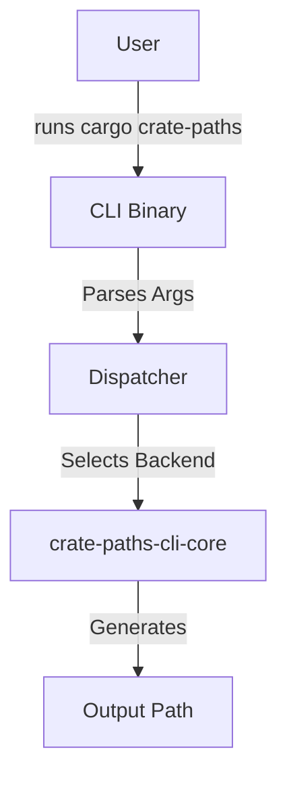

# Architecture

## Overview

`crate-paths-cli` is the command-line interface for the `crate-paths` ecosystem. It acts as a Cargo subcommand (`cargo crate-paths`) to generate path trees for crates.

## Design

The CLI is a thin wrapper around the logic provided by `crate-paths-cli-core`. It handles argument parsing, subcommand dispatch, and backend selection.

### Components

- **`main.rs`**: Entry point. Uses `clap` for argument parsing.
- **`Backend` Enum**: detailed selection of the source (Rustup, Local, Docs.rs).

## Data Flow

