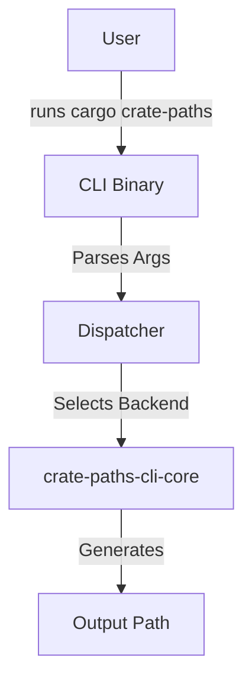

# Architecture

## Overview

`crate-paths-cli` is the command-line interface for the `crate-paths` ecosystem. It acts as a Cargo subcommand (`cargo crate-paths`) to generate path trees for crates.

## Design

The CLI is a thin wrapper around the logic provided by `crate-paths-cli-core`. It handles argument parsing, subcommand dispatch, and backend selection.

### Components

- **`main.rs`**: Entry point. Uses `clap` for argument parsing.
- **`backend/mod.rs`**: Backend selection and dispatch (Rustup, Local, Docs.rs).
- **`writer.rs`**: Writes generated code to the output file.

### Output Path Resolution

The `--output-path` argument determines where the generated code is written:

- If the path has a file extension (e.g., `./paths.rs`), it writes directly to that file.
- If the path has no extension (e.g., `./generated`), it treats it as a directory and writes to `{crate_name}.rs` within it.

## Data Flow

